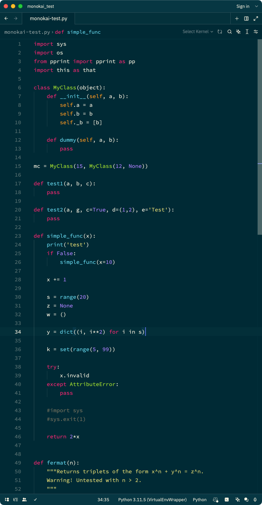

# Monokai Themes for the Zed Code Editor

This repo contains 3 Monokai themes for the wonderful [Zed](https://zed.dev) Code Editor.

## Installing
- Copy the `.json` files from this repo into `~.config/zed/themes`.
- Run [Zed Preview](https://zed.dev/releases/preview)
    - As of this writing (2024-02-03) only "Zed Preview" supports "[User Themes](https://zed.dev/blog/user-themes-now-in-preview)".  No doubt they support for User Themes will make it into the regular Zed build soon.
- Select your theme (Settings -> Select Theme).

## The Themes
### Monokai
This is my best attempt at reproducing a classic Monokai theme within the current limitations of Zed's syntax highlighter. It is _strongly_ based on Monokai-ST3 (below), with only minor tweaks.

Today (2024-02-03) there are several cases in which different code elements which would traditionally have different colors in Monokai share the same syntax selector in Zed, so it is not (currently) possible to style (color) them differently.

One example is function name definitions (traditionally green) vs. function name calls (traditionally blue).  Another is code variables (traditionally white) vs function arguments (traditionally orange).

As Zed's syntax highlighting capabilities grow I will try to align this theme more closely with traditional Monokai.

### Comparison

Here is a comparison of my Zed `Monokai` theme (left) vs. traditional Monokai in VSCode (right).

### Monokai-ST3
This is a direct conversion of [Monokai-ST3-theme-for-vscode
](https://github.com/volosovich/Monokai-ST3-theme-for-vscode) VSCode theme, performed using the Zed team's `theme_importer` tool.

### One Monokai
This is a direct conversion of [One Monokai](https://github.com/azemoh/vscode-one-monokai/tree/master) VSCode Theme, performed using the Zed team's `theme_importer` tool.

### Monokai Solarized
But why, sir... WHY???

Today I run both Zed and VSCode, and I need to be able to tell them apart easily, but my brain is trained on Monokai so I wanted a theme which was "still monokai" but was also *instantly* recognizable as being "a different editor".

This theme is just a shameless merge of the "Monokai" syntax highlighting above with the core "Solarized" theme's background so that I can tell the two apart.

